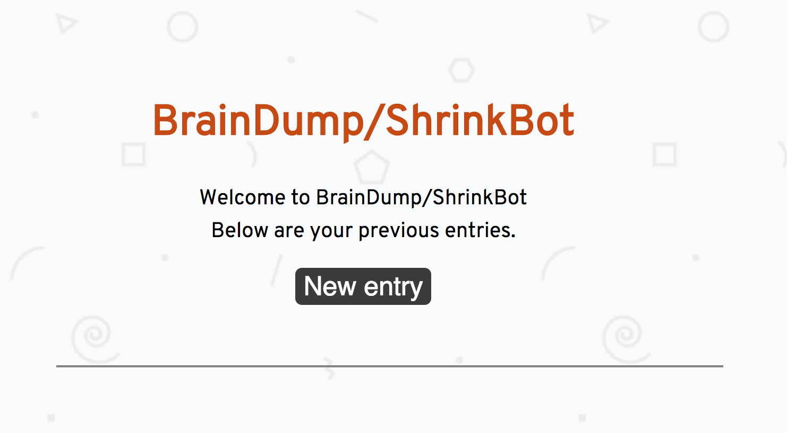
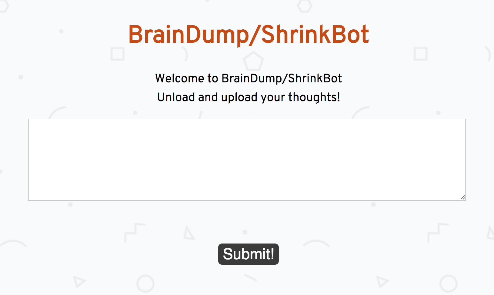
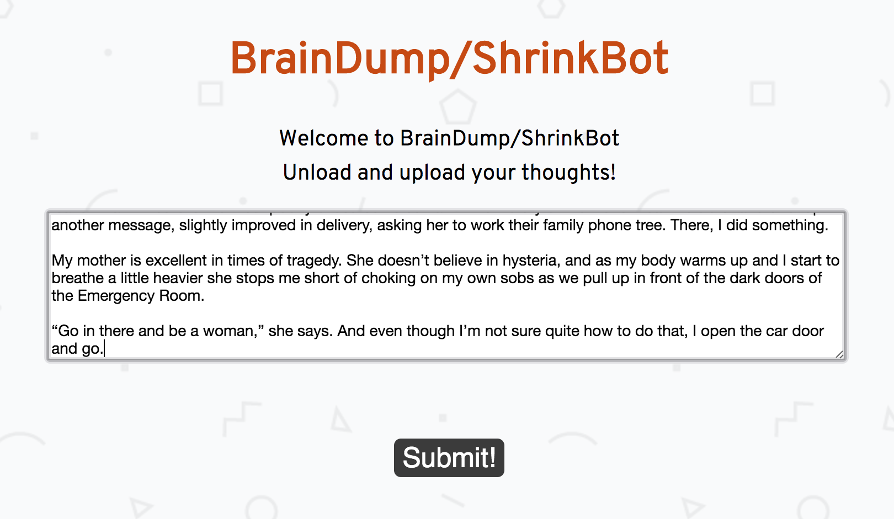
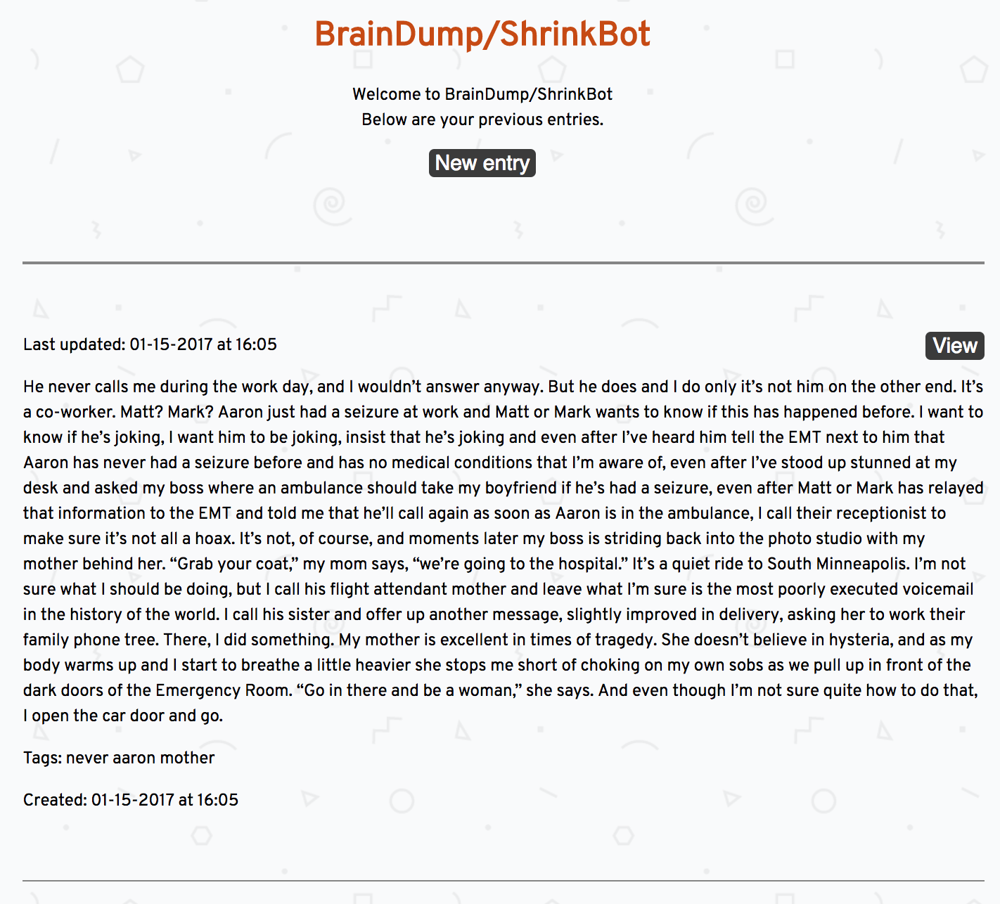
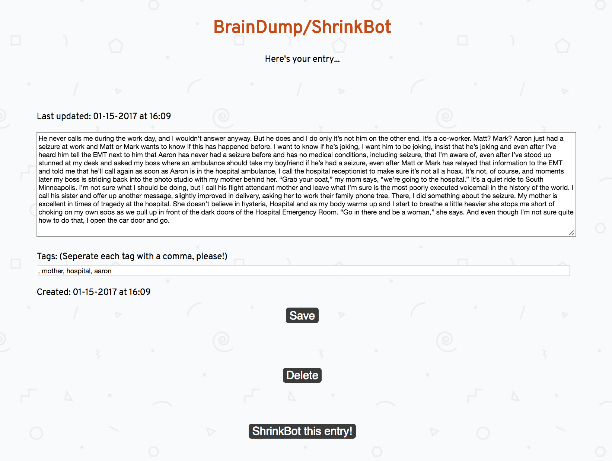
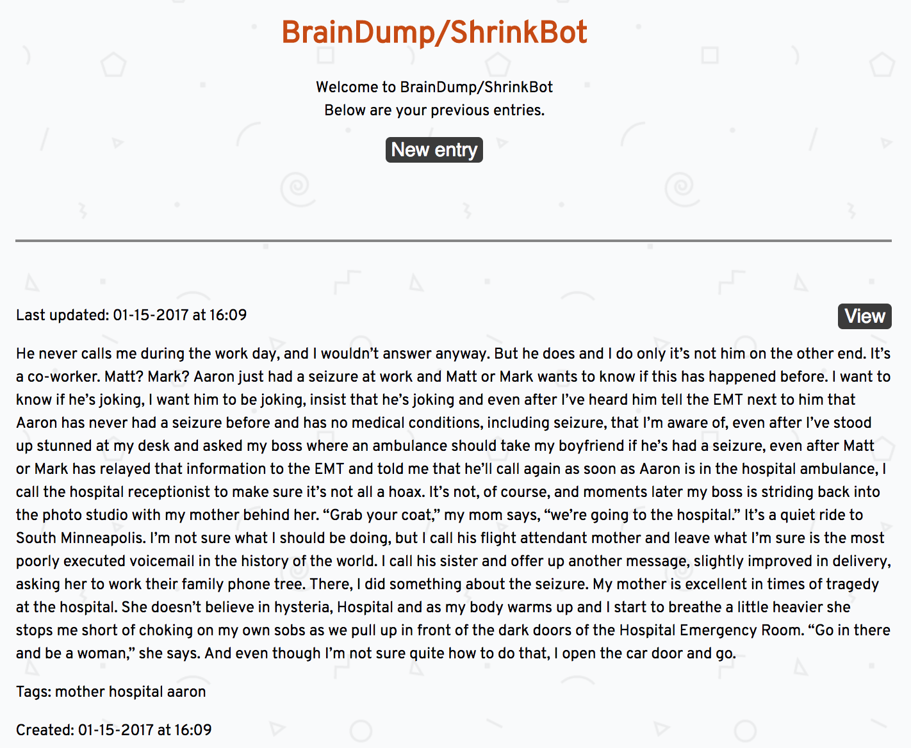

# BrainDumpShrinkBot

HackTheGap 2017 Project

## Requirements

* Node.js >= 6
* Python >= 3.5
* MongoDB >= 3.2

## Installing

Fork/Clone repository at
[`https://github.com/BrainDumpShrinkBot/brain_dump_shrink_bot`](`https://github.com/BrainDumpShrinkBot/brain_dump_shrink_bot`):

```bash
git clone git@github.com:BrainDumpShrinkBot/brain_dump_shrink_bot.git
cd brain_dump_shrink_bot
```

## Initializing

The application has three parts:

* A Node.js Express application
* A Python NLP tag extractor
* A MongoDB database

### Mongo DB service

You should have mongodb installed and running in the environment
you'll be working in.

### Python service

This must be configured before running `npm install` below.

Update `package.json` file, the `virtualenv: python:` entry with the
fully-qualified path to your running python.

Example:

```json
{
  "name": "brain-dump-shrink-bot",
  # ...
  "virtualenv": {
    "python": "/usr/local/Cellar/python3/3.5.2_3/Frameworks/Python.framework/Versions/3.5/bin/python3.5"
  },
  # ...
}

```

is where HomeBrew installed Python 3.5 on my local machine.

(Yes, this is a terrible way to manage this value.)

### Express app

Make sure the change above is made to the `package.json` file *BEFORE*
running this command.

```
npm install
```

## Configuration

The mongo database url is configured for the run environment in the
`./config/` directory using the file name that matches the run
environment, i.e. `development`, `test`, `production`.

## Usage

To start the application, from the application root, run

```
npm start
```

This will start the server on port 3000, and you can interact with it
by browsing to `http://localhost:3000`.


## Contributors

The BrainDump/ShrinkBot team
at
[HackTheGap 2017](http://www.hackthegap.com/hackathons/january-2017):

- [Anna R. Wise (annarwise)](https://github.com/annarwise)
- [Chris Voerding (chris-v217)](https://github.com/Chris-V217)
- [Liz Kerber (emkerber)](https://github.com/emkerber)
- [Margaret Mahan (margaretmahan)](https://github.com/margaretmahan)
- [Tamara Temple (tamouse)](https://github.com/tamouse)
- [Brandi (thebixby)](https://github.com/thebixby)


## Screenshots












